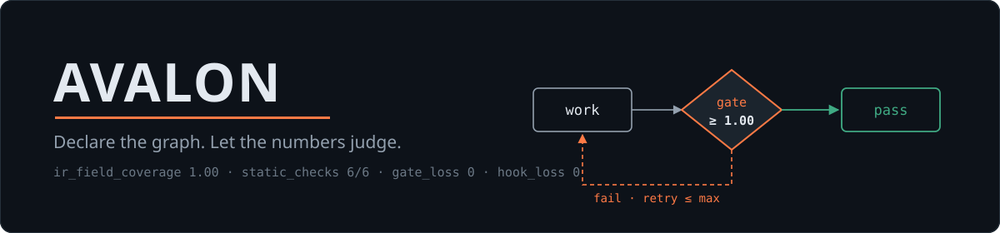
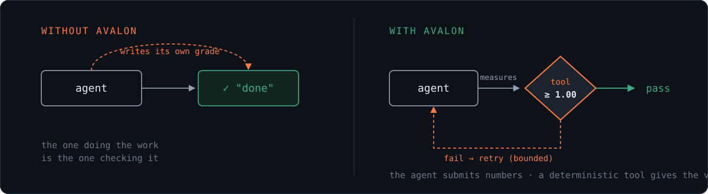
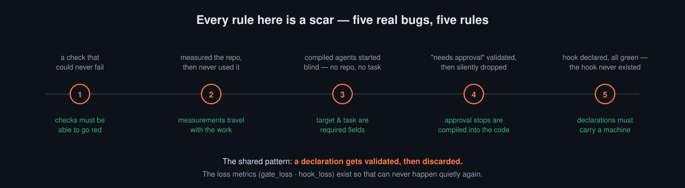
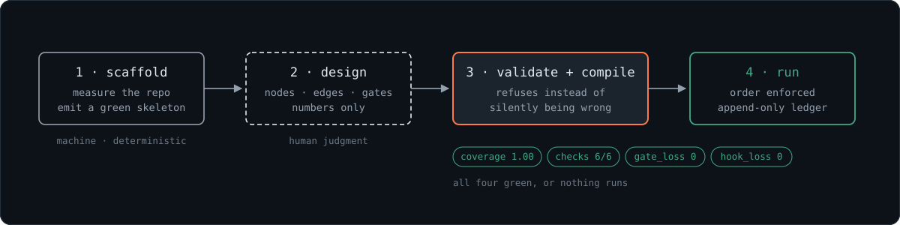
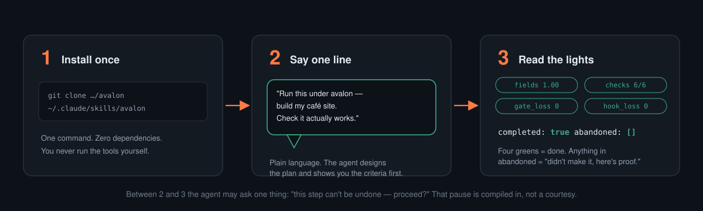
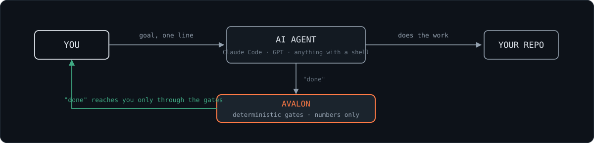
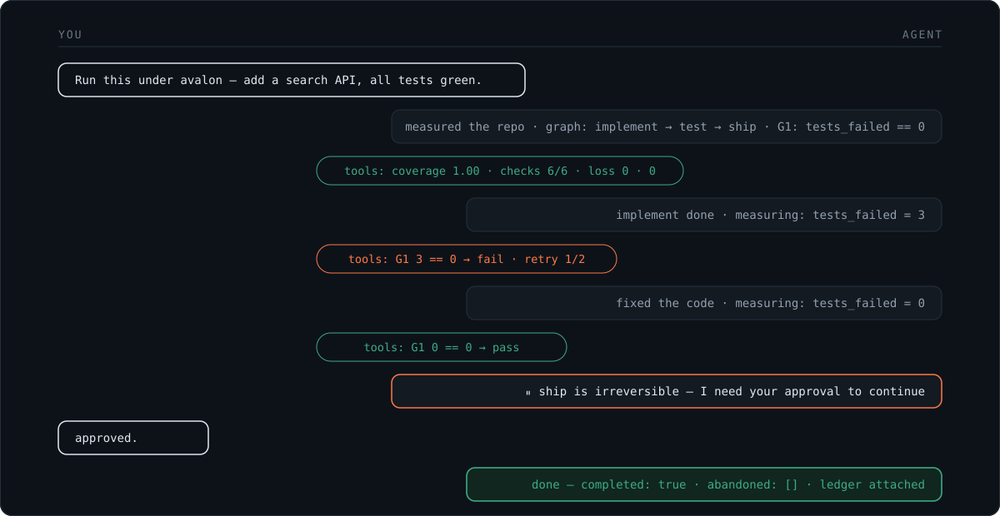
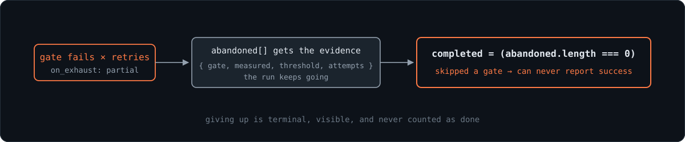
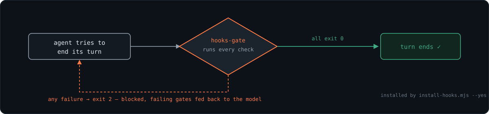

<div align="center">



**AI 智能体的"完成了"只是一个意见。Avalon 把它变成一次测量。**<br/>
在开工之前就把通过条件钉成数字。裁决交给工具，而不是 AI 自己。

[](https://www.npmjs.com/package/avalon-skill) [](https://github.com/Evanciel/avalon/actions/workflows/test.yml)    [](LICENSE)

[English](README.md) · [한국어](README.ko.md) · [日本語](README.ja.md) · **简体中文**

</div>

- [为什么会有这个项目](#为什么会有这个项目)
- [Avalon 做什么](#avalon-做什么)
- [三步开始](#三步开始)
- [一次运行是什么样子](#一次运行是什么样子)
- [保证](#保证)
- [深入内部](#深入内部) — [框架](#框架里有什么) · [四个阶段](#四个阶段) · [三种运行方式](#三种运行方式) · [教程](#教程真刀真枪跑一遍) · [图的格式](#图的格式) · [工具](#逐个工具讲) · [伤疤](#规则从哪里来) · [书面痕迹](#设计的书面痕迹) · [自我应用](#avalon-跑在-avalon-上)
- [如何测试](#如何测试)
- [仓库地图](#仓库地图)
- [诚实的局限](#诚实的局限)

## 为什么会有这个项目

这个项目始于一个小小的谎言 — AI 智能体每天都在说的那种，而且并非有意。

一个智能体接过一项多步骤任务，被留下独自干活。它计划得不错，干得也卖力，最后回来报告：**"完成了 — 全部通过。"** 说得很有说服力。但也是错的。有一步被悄悄放弃了，有一项检查被悄悄跳过了，而循环里没有任何东西有理由提起这两件事。

没有谁存心撒谎。问题是结构性的：**干活的和打分的是同一个模型。** 学生给自己阅卷，不需要坏心眼也会打出 A — 而一个通宵无人值守、重试到一切看起来变绿为止的智能体，会心安理得地说服自己一整晚。



解法古老而无聊，正因如此才管用：**把裁决挪到外面去。** 在开工之前，先把计划画成一张图 — 节点是要做的事，边是顺序，门是**只能写数字**的通过条件。裁决由一组小而确定性的工具来做。它们从不调用 LLM，所以同一张图永远得到同一个裁决。活儿还是智能体全干 — 它只是失去了给自己打分的权利。

这个仓库里没有一条规则是在白板上设计出来的。每一条的背后，都是本项目自己开发过程中真实漏过去的一个 bug — 一共五个，如今每个都变成了一条规则，底下站着一个回归测试：



（完整的故事在[规则从哪里来](#规则从哪里来)。连这个项目最初的宣传话术都没能活过自己的调研阶段 — 见[设计的书面痕迹](#设计的书面痕迹)。）

**什么时候用 Avalon：** 你把大活交给智能体（4 个以上文件、难以回退的步骤），你让智能体无人值守地跑，或者你只是不再相信没有证据的成功报告。改一两个文件的小活**别用它** — 画计划的成本超过活本身，就是本末倒置。

## Avalon 做什么



四步之中，两步是机器，一步是你（或智能体 — 由握着否决权的机器盯着），还有一步是看着活儿发生的机器。判断只在第 2 步进场 — 决定节点和门该是什么的那一刻。它周围的一切都是确定性的，这正是重点：判断只以数字的形式记录一次，此后没有任何人能凭感觉重新裁决。

具体来说，"门"指的就是这样一行 — 而且*只能*是这样一行：

```jsonc
{ "field": "tests_failed", "op": "==", "threshold": 0 }
```

格式里没有任何地方可以写"检查一下效果好不好"。散文不是通过条件。

## 三步开始



### ① 安装一次

```bash
git clone https://github.com/Evanciel/avalon ~/.claude/skills/avalon
```

对 Claude Code 来说，安装到此为止 — [SKILL.md](SKILL.md) 的 frontmatter（`name: avalon`）负责注册技能。零依赖，Node 18+；工具是一组独立的 `.mjs` 文件，你永远不需要亲手去跑。（只要工具链、不要技能的话，npm 上也有 — `npm i avalon-skill`。想折腾仓库本身：`git clone https://github.com/Evanciel/avalon && cd avalon && npm test`。）

### ② 说一句话 — 用大白话

你不需要知道"图"或"门"是什么。说出目标，再加一句"确认真的能用"：

**从零开始** — 现在什么都还没有：

```text
用 avalon 来做 — 从零给我的咖啡店做个网站：
菜单页、位置导航、"联系我们"表单。三个都要确认真的能用。
```

**给正在做的东西加功能** — 在那个项目的文件夹里打开 Claude Code 直接说。智能体动手之前会先实测已有的东西：

```text
用 avalon 来做 — 给我做到一半的网站加个"预约"功能。
确认新预约真的会出现在列表里。
```

**不敢乱动的修改：**

```text
用 avalon 来做 — 修一下支付部分。凡是撤销不了的步骤，动手前先问我。
```

**睡觉时交给它：**

```text
用 avalon 来做 — 趁我睡觉把这个清单处理完。
有门不过就停下 — 别糊弄过去。
```

措辞随意（"用 avalon 来推进"、"按 avalon 的流程走"…）— 技能的触发词就是这个名字。数字、门、图都由智能体来设计；它*必须*做的，是**在开工之前**用大白话把标准亮给你看 — 比如"点发送后，已保存的留言必须多一条；失败的检查为零"。你只需要回答：这是不是你心里的"做完"。

### ③ 看红绿灯

最后你会得到四个数字，外加两栏智能体无法伪造的字段：

- **四个绿灯**（`coverage 1.00 · checks 6/6 · gate_loss 0 · hook_loss 0`）— 计划本身是健全的，翻译过程中什么也没丢。
- **`completed: true`** — 每个门都靠真实测量通过了。
- **`abandoned: []`** — 空，意味着没有任何东西被放弃。列表里*有*东西，意思是"这部分没做成，证据在此：测到了什么、标准是多少、试了几次"。

你的全部角色，就三个动作：开跑前读一遍标准清单，回答"对，'做完'就是这个意思" · 它问*"这一步无法撤销 — 继续吗？"*时回答它 · 最后看红绿灯。

你永远不用碰的东西：`graph.json`（智能体写）、命令（智能体敲）、阈值（智能体提议 — 你只需回答它们是不是你心里的"做完"）。

### 不只是 Claude

框架里没有任何 Claude 专属的东西 — 工具就是普通的 Node CLI，没有 API 密钥，不调用任何厂商。任何能跑 shell 命令的智能体，都可以直接指给它流程：

```text
克隆 https://github.com/Evanciel/avalon，读 SKILL.md，
然后按它的流程推进这个任务：<你的任务>
```

每个智能体受到的待遇都一样：验证器对它的图草稿行使否决权，运行器拒绝它抄近道，编译出的 `completed` 标志无视它的意见。就算完全没有 AI，运行器 CLI 也照样能用 — 当作一份给人类的纪律清单。

## 一次运行是什么样子



Avalon 不取代你的 AI 智能体 — 它插在智能体的"完成了"和你的信任之间。活儿还是智能体全干，只是它的说法在到达你之前必须过门。

从你敲下的那一句话开始，无需再指挥：



1. 智能体先跑 `scaffold`、起草图，在动手之前把四个数字亮给你看。
2. 它逐节点干活、提交测量值；工具回答通过或不通过。
3. 在不可逆节点它停下来问你 — 这次停顿是编译进产物里的，不是客气。
4. 最终消息带着 `completed` 和 `abandoned[]` 证据列表 — 它无法伪造的两栏。

想看一次真实会话、连失误都包括在内？下面的[教程](#教程真刀真枪跑一遍)逐字重放了一场。

## 保证

| 承诺 | 怎么兑现 |
|---|---|
| 假成功不可能 | 跳过门的运行没有任何办法把自己上报为成功 — 真正执行编译产物的测试证明了这一点 |
| 放弃会留下证据 | 尝试次数和实测值都在案；没有"差不多得了" |
| 裁决不漂移 | 裁决工具从不调用 LLM。同一张图，同一个裁决 — 情绪和说服都不管用 |
| 检查本身也被审计 | 每条机器强制的检查都必须证明自己*能*失败 — 对准一份已知损坏的输入，它必须变红，否则拒绝安装 |
| 记录无法被悄悄改写 | 每条测量都与前一条哈希相连；修改、删除或重排过去的任何一行，所有命令都会拒绝执行，直到有人来查看 |

### 放弃不等于成功



当一个门耗尽重试、且配置为 `on_exhaust: partial` 时，工作流会继续前进 — 但会把 `{gate, node, field, op, threshold, measured, attempts}` 记入 `abandoned[]` 列表，而只要这个列表非空，最终的 `completed` 标志就被**强制置为 false**。跳过了门的运行，没有任何办法把自己上报为成功。执行语义测试通过真正运行编译产物把这一点钉死。

### 规格不等于安装



编译器输出 `build/hooks.json` — 每个门的 check 命令加退出码契约 — 并刻意止步于此。安装它是另一个工具、另一次人工审批；一旦装好，只要有门是红的，会话就真的无法结束回合。自动安装始终被禁止：一个悄悄把自己接进你会话强制层的工具，恰恰是这个项目要防的那种无法问责的魔法。安装之前，规格不拦截任何东西 — 而且完成报告被要求原样写出这句话。

### 每条检查都必须证明自己能失败

一条*不可能变红*的检查打出的绿勾，是装饰品，不是强制力。所以钩子条目可以声明一个 `probe`（探针）— 同一个判据对准一份已知损坏的输入，此时它**必须**以非零退出码结束。安装器在安装任何东西之前运行全部已声明的探针。一个以 exit 0 结束的探针，恰好当场演示了一条不可能失败的检查，安装即被拒绝：

```text
$ node tools/install-hooks.mjs graph.json build/hooks.json --yes
installer refused: probe refuted nothing — these checks cannot fail (or the probe never finished), so they enforce nothing:
  G1: probe exit 0 ← node -e "process.exit(0)"
```

（译：安装器拒绝 — 探针什么也没反驳：这些 check 不可能失败（或探针根本没跑完），所以它们什么也强制不了。）

健康的计划会逐门打印反证：

```text
  probe   G0  exit 1 ✅ (the oracle can fail)
  probe   G0b  exit 1 ✅ (the oracle can fail)
  probe   G4c  exit 1 ✅ (the oracle can fail)
```

这三行来自这个仓库自己的门 — 每条都对准一份已提交的损坏夹具（[tools/fixtures/](tools/fixtures/)），必须将其拒绝。

### 证据会自卫

每条被接受的测量都落进一份只增不改的台账，而台账是一条**哈希链**：每一行都携带前一行的哈希，状态文件锚定链头。下面是一条已记录的测量在事后被篡改时真实发生的事 — 所有命令都拒绝，不只是 `verify`：

```text
$ node tools/run.mjs graph.json next
🔴 ledger chain broken — refusing every command:
  line 3: h mismatch — the line was edited
  the ledger is the evidence layer; a run on tampered evidence proves nothing.
  → inspect the ledger, archive it elsewhere, remove it, then re-init
```

（译：台账链断裂 — 拒绝所有命令：第 3 行 h 不匹配，该行被改过；台账是证据层，在被篡改的证据上运行什么也证明不了 → 检查台账、异地归档、删除后重新 init。）

在链所在的代码处、也在这里诚实写明：这是"篡改可发现"（tamper-evident），不是"篡改不可能"（tamper-proof）— 见[诚实的局限](#诚实的局限)。

## 深入内部

下面的一切写给想看机器内部的读者。如果你只是想用，你已经知道得够多了 — 上面的三步就是完整的用户手册。

### 框架里有什么

| 组件 | 做什么 |
|---|---|
| **图 (JSON IR)** | 计划本身。一个门就是 `字段 + 运算符 + 数字` — 根本没有地方写"检查一下效果好不好"这种话 |
| **验证器** | 必填字段全量检查（G0）+ 6 项静态检查 + 在表达层面就拒绝描述性门的模式 |
| **编译器** | 把图翻译成可执行的多智能体工作流。哪怕有一个门在翻译中丢失，就拒绝编译（`gate_loss`） |
| **运行器** | 在执行时强制顺序。不能跳序启动节点，不能不测量就完成节点，每次测量都记入只增不改的台账 |
| **钩子规格 + 安装器** | 输出 `build/hooks.json`，让门也能从会话**外部**被强制执行 — 再由带审批门的安装器把它作为 Stop 钩子接进项目 settings。声明了钩子却没有真实命令，会被 `hook_loss` 抓住 |
| **脚手架** | 实测目标仓库，生成一个已经通过验证的骨架 — 从绿色开始，保持绿色 |

### 四个阶段

Avalon 的架构是四个阶段，这个仓库里的工具就是它们的实现：

| 阶段 | 角色 | 实现 |
|---|---|---|
| **① FRONTEND** | 声明 — 实测仓库、写出 IR | `scaffold.mjs` + 你的判断，否决权在 `validate.mjs` |
| **② BACKEND** | 编译 — 无损翻译，否则拒绝 | `compile.mjs`（`gate_loss`、`hook_loss`、审批停机、钩子规格） |
| **③ DRIVER** | 执行 — 在数字门之下驱动到完成 | `run.mjs`，或在智能体编排宿主上运行的编译产物 |
| **④ ARCHIVE** | 积累 — 完成的运行变成案例，回流到设计 | **刻意休眠** — 在前提条件（针对对抗性输入的威胁模型）满足之前保持关闭。还不安全的阶段就声明为休眠，而不是偷偷跑一半 |

阶段之间的边界才是承重的部分：判断只在①进场，②要么无损要么拒绝，③只执行不裁决，④现在还不被允许存在。每条边界背后都至少有一道伤疤（见[规则从哪里来](#规则从哪里来)）。

### 三种运行方式

**① 一发到底，作为技能 — 预期用法。** 你只说目标，剩下的交给智能体：

1. 对目标仓库运行 `scaffold` 实测。
2. 把工作拆成节点、写好门。这是判断步骤 — 草稿由智能体起草，否决权在验证器手里。
3. 盖章 → 验证 → 编译，把[四个数字](#四个数字)全部变绿。
4. 执行编译出的工作流：每个节点一个子智能体，每次交接都过数字门，直到整张图完成。

它会自己驱动到完成，只有两个例外 — 而这两个例外正是全部意义所在：不可逆的步骤会停下来等人审批；被它放弃的门留在 `abandoned[]` 里 — 智能体无法悄悄拍板"差不多得了"。

**② 编译出的工作流。** `compile.mjs` 把图变成智能体编排宿主用的工作流脚本（每个节点一个 `agent()` 调用，扇出用 `parallel()`）。支持从停机点恢复，以及对特定不可逆节点预先审批：

```
Workflow({ scriptPath: "build/graph.workflow.js",
           args: { resume_from, resume_state, resume_loops, approved: ["<node-id>"] } })
```

`policy.requires_approval: true` 的节点，只要 id 不在 `approved` 里，就会**在执行前停下**。默认值是空集合 — 有回归测试钉着，所以审批门无法悄悄变成空操作。

**③ 运行器 CLI — 手动或智能体直接驾驶。** 当会话不派子智能体、自己直接过节点时：

```bash
node tools/run.mjs graph.json init            # create state (after editing the graph: init --force)
node tools/run.mjs graph.json next            # what can be worked on right now
node tools/run.mjs graph.json status          # whole picture, including gates that never ran
node tools/run.mjs graph.json start <node>    # refused if the node isn't in the frontier
node tools/run.mjs graph.json measure <field> <value> [note]
node tools/run.mjs graph.json done <node>     # the tool decides pass/fail, not you
node tools/run.mjs graph.json verify          # ledger hash-chain check (tamper / truncation)
node tools/run.mjs graph.json abort           # cancel the active node
node tools/run.mjs graph.json lint            # OR-trap check (2+ gates on one node)
```

每个命令都支持机器可读输出 `--json`。运行器基本上就是一份"不许发生的事"清单 — 四条不变式（INV-1 到 INV-4，见 [run.mjs](tools/run.mjs)）：

| 你尝试 | 运行器的回答 |
|---|---|
| `start` 一个还没轮到的节点 | 拒绝 — 并列出你现在*可以*启动的节点 |
| 本次访问没有新测量就 `done` | 拒绝 — 旧测量值不结转，过期的绿灯混不过重试 |
| `measure` 一个图里从未声明的字段 | 拒绝 — 测量未声明的字段，不过是走了流程的瞎猜 |
| `init` 之后改图继续跑 | 标记 **STALE** — 状态记得自己是从哪个图哈希生出来的 |
| 门失败次数超过 `max_retry` | **停机** — 运行停止，决定权交还给人 |

每条被接受的测量都追加到台账。台账里的任何内容都永不改写 — 就连 `init --force` 也只丢弃状态、保留台账。而且台账会自卫：见[证据会自卫](#证据会自卫)。

工具消息默认英文；韩语系统区域（或 `AVALON_LANG=ko`）会切换成韩文（中文暂未提供）。构建产物永远是英文 — 它们的字节参与哈希，不能依赖环境。

### 教程:真刀真枪跑一遍

下面的一切都真实发生过 — 命令和输出取自一次实况会话，连失误都包括在内。（这些输出捕获时工具消息还是韩文 — 工具现已默认英文，`AVALON_LANG=ko` 可切回韩文；此处展示的是内联译文。）

假设你有个小 Node 项目 `my-api`，想让智能体加一个搜索端点并让测试通过。

**1. 脚手架。** 把仓库路径和一句话任务指给它：

```bash
node tools/scaffold.mjs ../my-api "add a search API and make the tests pass" ../my-api/graph.json
```

你会得到一个已经通过验证的三节点骨架（`survey → check → review`），技术栈和规模已实测，两个哈希已盖章。

**2. 设计。** 把占位符换成真实计划 — 三个节点，一个门：

```jsonc
"state": [{ "field": "tests_failed", "type": "int", "unit": "count" }],
"gates": [{
  "id": "G1", "field": "tests_failed", "op": "==", "threshold": 0,
  "on_fail": { "goto": "implement", "max_retry": 2 },
  "ground_truth": "measured",
  "threshold_source": "the whole suite must pass — partial passing is not a ship criterion"
}],
"edges": [
  { "from": "implement", "to": "test", "when": "always"       },
  { "from": "test", "to": "implement", "when": "gate:G1:fail" },
  { "from": "test", "to": "ship",      "when": "gate:G1:pass" }
]
```

（译：`threshold_source` — 整个套件必须全过，部分通过不是发布标准。）

**3. 盖章与验证。** 写这个教程时我们真出了个错 — 改了节点名却忘了 `graph.entry`。验证器在任何东西运行之前就抓住了它：

```
$ node tools/validate.mjs graph.json
  FAIL  reachability
         ↳ graph.entry 'survey': no such node
  static_checks_passed  5/6      G4c FAIL
```

（译：可达性检查 FAIL — `graph.entry 'survey'`：没有这个节点。）

改好 entry，重新盖章（`hash.mjs --write`），重新验证 → `6/6`，覆盖率 `1.00`。

**4. 编译。**

```
$ node tools/compile.mjs graph.json build/graph.workflow.js
  gate_loss  0      PASS
  hook_loss  0      PASS
  compiled → build/graph.workflow.js
  hooks    → build/hooks.json
```

**5. 执行。** 运行器会话实录（仅添加注释）：

```
$ run.mjs graph.json init
$ run.mjs graph.json start ship          # trying to skip ahead
🔴 not in the frontier: ship — you can start: implement

$ run.mjs graph.json start implement     # ok — do the actual work here
$ run.mjs graph.json done implement      # opens: test

$ run.mjs graph.json start test
$ run.mjs graph.json done test           # forgot to measure
🔴 cannot judge the gate — no measurement this visit:
   G1: tests_failed was never measured

$ run.mjs graph.json measure tests_failed 3 "npm test: 3 failing"
$ run.mjs graph.json done test
🔴 G1: tests_failed=3 == 0 → fail        # loops back to implement (attempt 1/2)

# ...fix the code, come back through implement → test...
$ run.mjs graph.json measure tests_failed 0 "npm test: all green"
$ run.mjs graph.json done test
🟢 G1: tests_failed=0 == 0 → pass

$ run.mjs graph.json status
  ▶ ship  (human/manual)  ⏸ waiting for a person   # irreversible → a human takes the exit
```

（译：想跳步启动 ship → 🔴 不在前沿集，现在能启动的是 implement；没测量就 done → 🔴 无法裁决，G1 的 tests_failed 一次都没测过；报 3 → 🔴 fail，退回 implement（重试 1/2）；报 0 → 🟢 pass；最后 ship 是 human 节点，⏸ 等待人类 — 不可逆的出口由人来接。）

注意从未发生的事：没有人问过智能体"做完了吗？"。它报 `3`，工具说 fail；它报 `0`，工具说 pass。

**6. 从会话外部强制执行（可选）。** 编译那一步已经输出了 `build/hooks.json`。安装它，就把门接进会话的 Stop 钩子 — 但安装器在没有明确审批之前拒绝动手：

```
$ node tools/install-hooks.mjs graph.json build/hooks.json
Install plan (nothing written yet):
  target  .claude/settings.json
  hook    Stop → node tools/hooks-gate.mjs graph.json build/hooks.json
  gates   G1
approval required — after user confirmation: same command with --yes    (exit 3)
```

（译：安装计划（还什么都没写）— 目标 .claude/settings.json，钩子 Stop，门 G1；需要审批 — 用户确认后，同一条命令加 --yes，当前以 exit 3 退出。）

加 `--yes` 才会安装；从那以后，只要有门是红的，会话就真的无法结束回合（`hooks-gate.mjs` 以 exit 2 退出，拦截结束）。安装后图变了，门会报 STALE 并拦截，而不是按过期规则放行 — 重新编译、重新安装才是解法。随时可用 `--uninstall --yes` 卸载。

### 图的格式

正本是一个 JSON 文件。组成部分：

**节点** — 要做的事。`kind` 是 `work`、`human` 或 `join`（v1.1 里的 `gate` 节点类型已废弃 — 门现在归边管）。每个节点带 `budget` 和 `retry.max`；不可逆的步骤挂上 `policy.requires_approval: true` — 编译器会把它变成真正的停机点。

**边** — 顺序。`when` 要么是 `always`，要么是 `gate:<id>:pass` / `gate:<id>:fail`。词汇表就这么多，没有"有时候"。

**门** — 通过条件。一个 JSON 对象，没有自由文本字段，不存在宽松解读的空间：

```jsonc
{
  "id": "G1",
  "field": "tests_failed",          // must be declared in state[] — unknown fields are rejected
  "op": "==",                        // one of  ==  >=  <=  >  <
  "threshold": 0,
  "on_fail": { "goto": "fix", "max_retry": 2 },
  "ground_truth": "measured",        // measured | reported | human | assumed
  "threshold_source": "why this number — forces you to justify it once, in writing"
}
```

（译：`field` 必须在 `state[]` 中声明，未知字段直接拒绝；`op` 是五种运算符之一；`threshold_source` 逼你把"为什么是这个数"白纸黑字写一次。）

`max_retry: 0` 的意思是*分支*而不是*停机* — "失败就不重试，走那条路"（降级发布路径、NO-GO 报告）。但如果零重试的分支指回一个已经完成的节点，那就是没有预算的循环，运行器会停下来。

执行 `done` 时，工具读取 `tests_failed` 的最新测量值，应用 `== 0`，回答通过或不通过。对阈值有异议，请在运行前提；运行中没有任何渠道对裁决讨价还价。

**状态 (state)** — 已声明的测量字段，每个都有类型：`int`、`ratio`、`bool`、`enum`、`ref`、`text`。能设门的只有 `int`/`ratio`/`bool` — 散文上设不了阈值，所以 `enum`/`ref`/`text` 得先派生成计数器。模式还会抓单位错误，比如给 `ratio`（0~1）字段设百分比阈值 90 — 一个永远过不了的门，真实发生过的 bug。

**指纹 (fingerprint)** — 目标仓库的实测事实（技术栈、规模、标记），由 `scaffold` 填写，禁止猜测。规模用区间记（`100-299` 个文件）— 精确数字明天就错了，区间能对很久。

**宿主 (host)** — 强制执行住的地方：`state_file`（运行器状态的存放处）、`enforced_by_hook`（要机器强制的门，每条形如 `{ "gate": "G0", "check": "node tools/validate.mjs graph.json" }` — 没有命令的声明正是 `hook_loss` 要数的东西）、`produces`。

**规格哈希** — `hash.mjs` 对图的规范形（键序无关、数组序保留）盖 sha256 章。所有下游产物都携带这个哈希，运行器靠它发现运行中被改的图（STALE），钩子靠它对上自己强制的到底是哪张图。

**模式版本管理** — `spec.version` 选择验证词汇表。旧的 v1.1 图按 v1.1 规则验证（它们是回归语料，拒绝它们就抹掉了基准线），但 v1.1 被标记为*不可执行* — 它没有"哪个仓库、什么任务"的字段，所以编译器拒绝。通过验证和可以安全执行是两个不同的主张，工具不把它们混在一起。

### 四个数字

**运行之前，四个数字必须全绿：**

| | 通过条件 | 含义 |
|---|---|---|
| `ir_field_coverage` | 1.00 | 13 个必填字段全部填写 |
| `static_checks_passed` | 6/6 | 图的结构没有问题 |
| `gate_loss` | 0 | 声明的每个门都进入了编译后的代码 |
| `hook_loss` | 0 | 声明的每个钩子背后都有真实命令 |

如果某个 loss 不为零，说明存在"只有声明、无人强制"的东西。那样的图是装饰品，工具会用非零退出码直说。

### 逐个工具讲

一组独立文件，彼此之间除 import 外没有依赖，谁都不调用 LLM（INV-1）。确定性是字面意思：同样的输入，同样的字节。

**`scaffold.mjs` — 实测，不猜。** 遍历目标仓库（跳过 `node_modules`、`.git`、构建产物；有上限，绝不爬 5 万个文件），检测技术栈，规模分桶，盖哈希章，输出一个**已经通过验证的**图骨架。节点是占位符 — 那部分是判断，归你。但昂贵的样板（13 个必填字段、哈希、retry/policy 默认值、一个必需的 human 节点）由机器填。从绿色开始、保持绿色，好过从红色开始、干等希望。

**`hash.mjs` — 规范 JSON + sha256。** 规范化（键序无关、数组序保留 — 顺序有含义）、哈希、把 `sha256:<64hex>` 盖进图里（哈希字段自身除外）。幂等 — 跑三次结果相同。STALE 检测和钩子对账全挂在这个章上。

**`validate.mjs` — G0 + 六项检查 + 有立场的模式。**

- **G0**：13 个必填字段全量。部分满足没有意义，所以标准是 1.00。
- **六项静态检查**：门只引用已声明的状态字段 · 不可逆节点有审批 · 每个节点可达 · 每个循环有上限（可终止性） · 每个节点有预算 · 每条边指向真实节点且 `when` 格式正确。
- **模式层面的拒绝**（检查还没跑就拒）：描述性门 — 用散文代替 `字段/运算符/阈值` 的门根本无法表达 · 未知运算符 · 给不可设门的类型设门 · 布尔阈值 · `host.enforced_by_hook` 里的幽灵门引用 · 新图使用已废弃词汇。
- **质量警告**（非致命）：缺 `scope`/`host`、声明了钩子却没有 check 命令。

**`render.mjs` — markdown 是产物。** 把 JSON 确定性地渲染成可读的 markdown。`--check` 会重新渲染并与已提交的 `graph.md` 做**逐字节**（sha256）比对 — 这就是 G0b 门。谁手改了 markdown，检查就爆。文档不可能偏离计划，因为文档就是计划的渲染。

**`compile.mjs` — 无损翻译，否则不翻译。** 从 IR 到工作流脚本的纯函数。内部禁止非确定性 — 没有 `Date`，没有 `Math.random`，不依赖对象键遍历顺序。它输出：

- 每个节点一个子智能体调用，每条提示词注入**共享上下文块**（指纹、target、task）— 实测事实跟着工作一起走；
- 有多条 `always` 边的节点**并行扇出**，分支汇合于单一 join；
- 保留 human 节点的门（由人测量的 `design_approved` 也是门，不是注释）；
- `requires_approval` 节点的**审批停机**，尊重 `approved` 参数（默认：谁都没被批准）；
- **恢复**支持（`resume_from`、`resume_state`、`resume_loops`）；
- **ABANDONED 台账**（[见上文](#放弃不等于成功)）；
- `build/hooks.json` — 每个钩子强制的门一条：`{ gate, field, op, threshold, check, expect_exit: 0 }`，靠规格哈希与图绑定。

然后它审计自己：IR 里的每个门都必须出现在输出里（`gate_loss`），声明的每个钩子都必须带着命令出现在 `hooks.json` 里（`hook_loss`）。任何地方有 loss → 退出码非零，产物不可信。

**`run.mjs` — 执行者。** 前沿集纪律、测量台账、门裁决、STALE 检测、停机交人。在上面的[三种运行方式](#三种运行方式)里讲过了；文件开头的四条不变式就是契约，自检的存在就是为了证明每一条真的会咬人。台账哈希链 — 以及它在被篡改时给出的拒绝 — 见[证据会自卫](#证据会自卫)。

**`install-hooks.mjs` + `hooks-gate.mjs` — 比会话活得久的强制执行。** 安装器接过 `build/hooks.json`，把它作为 Stop 钩子接进**项目的** `.claude/settings.json`。重点在它守住的边界：没有 `--yes` 就什么都不写（只打印计划并 exit 3 — 智能体不得在未经用户许可时自行加 `--yes`）；全局 `~/.claude` settings 即使加了 `--yes` 也拒绝；哈希对不上当前图的规格拒绝；别人的钩子条目原样保留；重复安装幂等。`--uninstall --yes` 随时取出来。

它还会**把获批的内容本身钉死**：审批时刻 `build/hooks.json` 的字节哈希被原样嵌进安装的命令里（`--approved sha256:…`）。此后文件以任何方式变动，门都会在**执行任何一条 check 之前**以 TAMPERED 拦下 — 没有这一层，对一个 JSON 文件的写权限就等于让任意命令在每一轮结束时自动执行的权限。唯一的回路是重新审批（`--yes` 重装）。

它还索要[每条检查都必须证明自己能失败](#每条检查都必须证明自己能失败)一节展示的反证。没有探针的钩子照常安装（报告为"未证明" — 不搞追溯性破坏）；`--status` 随时给出只读诊断：装没装、审批钉完好还是 TAMPERED、规格是最新还是 STALE — 一条 check 都不执行。

装好之后，每当会话要结束回合，`hooks-gate.mjs` 就跑一遍所有已声明的 check：全过 → exit 0；有一个不过 → exit 2，拦截结束，并把不合格的门反馈给模型。图变了就报 STALE 并拦截 — 悄悄执行昨天的规则，比停下来更糟。

### 规则从哪里来

这一切都不是在白板上设计出来的。每条规则的存在，都是因为一个真实的 bug 漏了过去；同一*类* bug 重复出现时，就给它编号：

| # | 发生了什么 | 现在靠什么防住 |
|---|---|---|
| 1 | 有一项永远不可能失败的检查 — 它重复询问另一项检查已经强制的条件 | 把检查重写为真正能打断循环的条件 |
| 2 | 项目指纹被测量并存进了 IR……却一个字也没进过提示词 | 共享上下文块 + 回归测试 |
| 3 | IR 里没有"哪个仓库、什么任务"的字段 — 编译出的智能体蒙着眼开工 | `target`、`task` 设为必填，缺失即拒绝编译 |
| 4 | `requires_approval` 通过了验证，编译器却悄悄丢掉了它 — 不可逆的 `git push` 编译后畅通无阻 | 审批门直接输出进代码 + 回归测试 |
| 5 | 钩子强制写进了 IR，各项检查全绿 — 但钩子文件从来就不存在 | 声明必须携带可执行命令，缺口由 `hook_loss` 来数 |

共同的模式：**声明先被验证，然后被丢弃。** loss 指标的存在，就是让这类 bug 无法被忽略。

### 设计的书面痕迹

[docs/graph/](docs/graph/) 里是完整的设计史 — 1,300 多行，没有一行是营销：

- **[avalon-graph.md](docs/graph/avalon-graph.md)** — v4 规格：每次修订都写明证据的版本史、四个阶段、门的名册（9 个激活，2 个因测量流程尚未定义而明确*搁置* — 没有流程的门不是门，所以停放起来，不假装存在）、从门设计中刻意移除的东西，以及把隐藏前提大声写出来的清单。
- **[ir-schema.md](docs/graph/ir-schema.md)** — 机器可读的 IR 规格：指纹（12 种固定标记，只许实测）、`target`/`task`、模式版本管理、状态白名单、六项静态检查、markdown 为何从 JSON 渲染，以及把 Avalon 自己的图当作完整示例 — 含"自我应用暴露了什么"一节。
- **[phase0-findings-v2.md](docs/graph/phase0-findings-v2.md)** — 杀死了宣传话术的调研："行业标准五层"这个框架被查明并不存在 · "自动设计"这个差异化卖点对照商业与学术先例后被证伪、废弃 · 而那些没找到反例的主张，*依然*不拿来做对外宣称 — 反例的缺席不是证明。

最后这个习惯就是整个目录的意义所在：文档记录的不只是 Avalon 是什么，还有它差点成为什么、以及那为什么是错的。

### Avalon 跑在 Avalon 上

仓库根目录的 [graph.json](graph.json) 不是示例 — 它是 Avalon 用 Avalon 管理自己开发的那张图。7 个节点（`frontend → validate → render_check → backend → compile_check → human_go → install_hooks`），6 个已声明的状态字段，3 个门（G0、G0b、G4c）通过 `host.enforced_by_hook` 机器强制 — 每个都带着真正执行检查的命令，外加一个对准已提交损坏夹具、证明该命令能失败的探针。[graph.md](graph.md) 是它的渲染，由 G0b 逐字节验证。

图的 `guarantees` 块是"诚实的局限"清单的机器化形态：`provides` 写明一次绿色运行到底证明了什么，`excludes` 写明它不证明什么。如果这个仓库自己的门变红，它的 CI 就会失败。

## 如何测试

158 个测试，分三个套件，`npm test` 一条命令全跑：

- **[test.mjs](tools/test.mjs)（93 个）** — 模式和编译器行为，包括**执行语义**：编译出的工作流产物在打桩的宿主上被真正执行，所以"abandoned 非空时 completed 为 false"这类主张是演示出来的，不是断言出来的。新增：**指纹辨别力** — 同一个仓库 scaffold 两次，指纹必须逐字节相同；两个不同的仓库，指纹必须不同 — 用真实的 scaffold 运行实测。在这些测试之前，指纹的辨别力一直是个*未经验证*的主张。部署同步门把 9 个运行时文件与已安装的技能副本逐字节比对，仓库和部署版无法悄悄漂移。
- **[run.selftest.mjs](tools/run.selftest.mjs)（41 个）** — 用唯一能证明护栏存在的方法测试运行器的拒绝墙：*删掉护栏，套件必须变红。* 每个测试构造一种被禁止的局面（跳前沿集的 start、没测量的 done、改图继续跑），只有运行器拒绝了才算通过。台账链测试攻击的是真实台账 — 改写过去的测量、截断尾部、绕过链追加 — 只有当所有命令都拒绝时才算通过。
- **[install.selftest.mjs](tools/install.selftest.mjs)（24 个）** — 用同样的方法测安装器的边界：无 `--yes` 不写、拒绝全局、拒绝过期规格、保留他人钩子、幂等重装，以及门在不合格与 STALE 时的拦截（exit 2）。其中 3 个是 TOCTOU 攻击场景：在审批*之后*篡改 `build/hooks.json` — 把 check 换成恶意命令，甚至连图带规格一致地重新生成 — 只有门**什么都不执行**就拦下时才算通过（用标记文件证明植入的命令从未运行）。其余的钉住探针之墙（不可能失败的判据按装饰拒绝）、`--status` 只读不写，以及默认语言确实是英文。

CI 在 ubuntu 和 windows 上都会跑这些套件。换行符通过 [.gitattributes](.gitattributes) 钉死为 LF — 因为 G0b 是逐字节的判据，CRLF 检出严格来说就是另一份文档。

## 仓库地图

```
SKILL.md / SKILL.ko.md   技能入口 — 流程与纪律（en / ko）
graph.json / graph.md    自我应用的图（JSON 为正本，md 是渲染产物）
tools/
  scaffold.mjs           实测仓库 → 生成绿色骨架
  hash.mjs               canonical JSON + sha256 盖章
  validate.mjs           G0 全量 + 6 项静态检查 + 模式版本管理
  render.mjs             JSON → markdown（--check 为逐字节判据）
  compile.mjs            IR → 工作流脚本 + hooks.json（从不调用 LLM）
  run.mjs                运行器 — 前沿集、哈希链台账、门裁决
  i18n.mjs               双语消息（默认英文，AVALON_LANG=ko 为韩文）— 产物永远英文
  install-hooks.mjs      带审批门的钩子安装器（仅限项目 settings）
  hooks-gate.mjs         Stop 钩子执行者 — 红灯的门拦截回合结束
  fixtures/              已提交的损坏输入 — 探针的靶子
  test.mjs               模式 / 编译器 / 执行语义 / 指纹测试（93 个）
  run.selftest.mjs       运行器自检 — "删掉护栏会变红吗"（41 个）
  install.selftest.mjs   安装器/门自检 — 审批·探针·防篡改之墙（24 个）
docs/graph/              设计史、IR 规格、上述伤疤的原始记录
images/                  本 README 的示意图
```

## 诚实的局限

- 工具只能证明**声明了的判据**。check 命令和它的人类语言标题是否同一个意思，仍然要靠人看。`probe` 收窄了这道缝 — 它证明判据*能*失败 — 但关不上它；任何确定性工具都关不上。
- `build/hooks.json` 只是规格。在通过 `install-hooks.mjs --yes`（人工审批的步骤）安装之前，它不拦截任何东西。
- 智能体节点在运行时产生的产物，无法在编译期验证。
- 台账链是"篡改可发现"（tamper-evident），不是"篡改不可能"（tamper-proof）：它抓得住修改、删除和截断，但把台账和状态文件一起一致地重写的人能骗过它。能抓住那种人的外部锚是④ ARCHIVE 的职责，而④仍在休眠。
- 工具消息默认英文（`AVALON_LANG=ko` 切换韩文；中文暂未提供）。代码注释和 [docs/graph/](docs/graph/) 里的设计史仍是韩文 — 推理都有记录，只是还没翻译。

完整的当前清单在自我应用图的 `guarantees` 块里。

## 许可证

[MIT](LICENSE)
